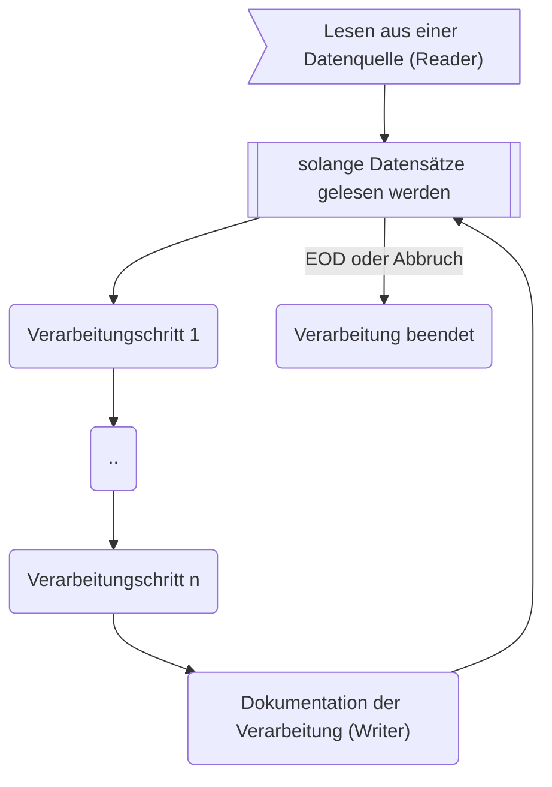
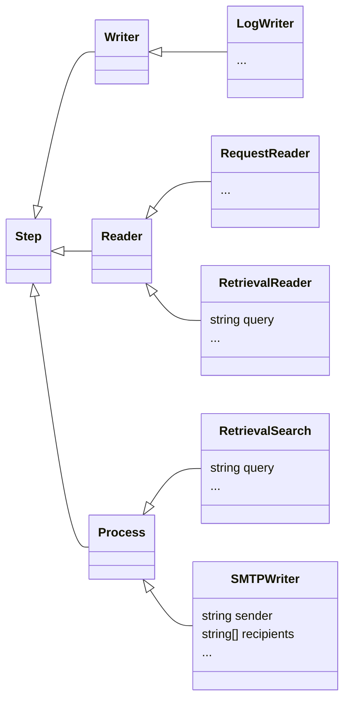

# P5 DMS Batch Execution Service

## Zweck des Service
Der *P5 DMS Batch Execution Service* ermöglicht die Ausführung jeglicher Art von asynchronen Hintergrundverarbeitungen (*Jobs*). Es können beliebig viele verschiedene Jobs in der Konfiguration hinterlegt werden. Angesprochen wird eine Job über einen eindeutigen Namen (*JobId*). Ein Job kann zur gleichen Zeit immer nur einmal ausgeführt werden.

Beispiele: 
    
* Dokumentenimport/Migrationen
* Replikation von und nach externen DMS Systemen 
* Manipulation von Dokumenten im Hintergrund 
* Überwachung des Datenbestandes 
* Versenden von Benachrichtigungen
* und vieles mehr...

${toc}

## Funktionsweise 
Jobs arbeiten nach dem allseits bekannten und grundlegenden EVA (Eingabe-Verarbeitung-Ausgabe) Prinzip. Die Eingabe (*Reader*) besteht aus der Ermittlung von Datensätzen aus einer Datenquelle, die Verarbeitung aus einer Folge von Einzelschritten (*Steps*) pro Datensatz, die Ausgabe (*Writer*) aus der Dokumentation des Ergebnisses der satzbezogenen Verarbeitung. 

Jobs werden streambasiert verarbeitet, d.h. es befindet sich immer nur ein, oder, durch das asynchrone Verhalten, wenige Sätze in der Vearbeitung. Der Speicherbedarf ist dadurch minimiert und es können sehr große Datenmengen verarbeitet werden.


### Reader, Writer und Verarbeitungsschritte
Ein Job besteht aus einem Reader, Writer und einem oder mehrerer Verarbeitungsschritten. Verarbeitungschritte, dasselbe gilt auch für Reader und Writer, werden über ein Typ (*type*) definiert, der die spezifische Aktion beschreibt, z.B. Versenden einer E-Mail, Suche nach Dokumenten oder der Transformation von Daten. 

Technisch betrachtet wird dies über Polymorphie gelöst und über das Class-Factory Pattern im Service verankert. Für jeden Typ lassen sich typspezifische Parameter setzen. So benötigt z.B. Verarbeitungsschritt *SMTPWriter* den Parameter *recipients*.



### Temporärer Datenspeicher während der Satzverarbeitung
Fast alle Verarbeitunsschritte benötigen Daten und erzeugen Daten. Diese Daten werden im Kontext des zu verabeitenden Satzes während der Abarbeitung eines Schrittes in einem temporären Datenspeicher gespeichert. Nachfolgende Schritte können diese Daten als Eingabeparameter verwenden. 

## Jobsteuerung 
Die Steuerung erfolgt im Wesentlichen über 3 Methoden:

Name | HTTP | URL | Beschreibung 
-|-|-|-
start | POST | /custom/batch/*\<jobid\>*/start | Start der Verarbeitung
stop | POST | /custom/batch/*\<jobid\>*/stop | Verarbeitung abbrechen
state | GET | /custom/batch/*\<jobid\>*/state | Vearbeitungsstatus zurückgeben 

## Dokumentation
Der Service ist selbstdokumentierend. Für alle Hintergrundverabeitungen werden dynamische Swagger Definitionen erzeugt, wordurch die Hintergrundverarbeitungen auch interaktiv über den Browser steuerbar sind. Zusätzlich ist für jede Verarbeitung eine detailierte Dokumentation über

Name | HTTP | URL | Beschreibung 
-|-|-|-
info | GET | /custom/batch/*\<jobid\>*/info | Aufruf der Dokumentation

abrufbar. Die Dokumentation  wird im Markdown Format zur Verfügung gestellt und kann über die Standard Browsermechanismen in PDF gewandelt werden.

## Konfiguration

### Globale Service Konfiguration
Wie im P5DMS üblich, wird die globale Konfiguration über die Konfigurationsdatei *default.yaml* und dort im Kontext *Batch* vorgenommen.

Es müssen zwei Parameter gesetzt werden: 

Parameter | Beschreibung 
-|-
context/Batch/config/file | Verweis auf die Konfigurationsdatei des Services 
context/Batch/config/templates | Beinhaltet das Verzeichnis mit den Vorlagen für die Dokumentation.

Beispiel: 
```yaml 
context:
  Batch: 
    server: 
      http: 
        port: 8087
    config: 
      file: batch/config.yaml
      templates: batch/templates
```

### Servicekonfiguration   
Die Service spezifischen Konfigurationsdatei, wird über *context/Batch/config/file* referenziert und hat folgenden Aufbau: 

```yaml
batchExecutor:
  # Dictionary mit Defaultwerten
  defaults: {}
 
  # Dictionary mit Logger Konfigurationen. Diese werden vom LogWriter Step verwendet
  logger: {}

  # Dictionary mit Jobdefinitionen.
  batches: {}
```

Tag | Beschreibung 
-|-
defaults | Dient zur Hinterlegung von Konstanten und Defaultwerten. Diese werden in den Jobdefinitionen verwendet und werden über das  Tag *_defaults* angesprochen.
logger | Dient zur Hinterlegung von Loggerkonfigurationen und werden von den *LogWriter* Schritten verwendet.
batches | Unter *batches* werden die Jobs definiert. Durch die Anlage als Dictionary ist die Eindeutigkeit der Namensvergabe (*JobId*) gewährleistet.

### Jobdefinition 
Jobs werden unter *batches* definiert und besitzen folgenden Aufbau:

```yaml
batches:
    # JobId des Jobs.
    myFirstJob: 
      # Titel für die Dokumentation
      title: FirstJob 
      # Beschreibung für die Dokumentation
      description: my first job definition
      # Optionen, wie z.B. Folgejobs 
      options: {}
      # Definition des Readers
      reader: {}
      # Ein Array mit Verarbeitungsschritten. 
      process: []
      # Definition des Writers
      writer: {}
```

### Konfiguration Reader
Der Reader wird unter *batches/\<JobId\>/reader* hinterlegt und besitzt folgende Eigenschaften: 

```yaml
      reader:
        # Titel für die Dokumentation
        caption: 
        # Beschreibung für die Dokumentation
        description: 
        # der Typ des Readers. 
        type: RequestReader | FileReader | WCS3Reader | RetrievalReader | LoopReader
        # die spezifische Konfiguration, abhängig von type 
        config: {}
```

#### RequestReader
Der RequestReader verwendet als Datenquelle den startenden Request.

#### FileReader
Der FileReader verwendet als Datenquelle die in den Parametern hinterlegte Datei.

#### WCS3Reader
Der WCSReader verwendet als Datenquelle eine Abfrage auf den Wilken Content Service.

#### RetrievalReader
Der RetrievalReader verwendet als Datenquelle eine Abfrage auf das Archiv.

Konfiguration:
```yaml
type: RetrievalReader 
config:
  # Variablenname für die Datenablage
  storeAs: <string>
  # Query für die Abfrage.
  query: <expression>
  # Resultset limit. Default ist 20, -1 unbegrenzt.
  limit: <int>
  # Projektion
  projection: <string>
  # Sortierreihenfolge, z.B. -createdate wäre nach Erstellungsdatum absteigend. 
  orderBy: <string>
```

#### LoopReader
Der LoopReader liefert als Input eine fixe Anzahl von Datensätzen. 

### Konfiguration Verarbeitungsschritte 

### Konfiguration Writer
